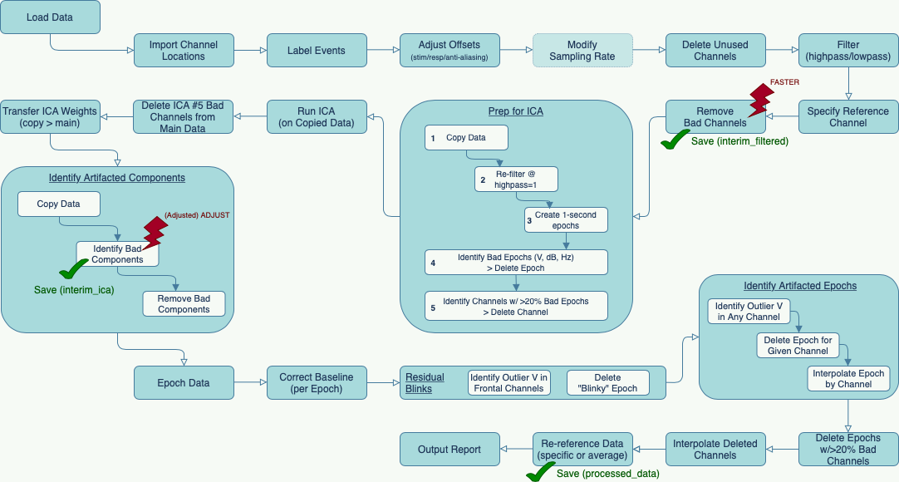

## Intro

This repository serves to showcase my nascent skills in processing EEG data.  It leverages a dataset of 40 individuals who completed a lexical decision task while EEG was recorded:
> The N400 was elicited using a word pair judgment task adapted from Holcomb & Kutas (1990). On each trial, a red prime word was followed by a green target word. Participants responded whether the target word was semantically related or unrelated to the prime word. (Kappenman et al., 2021)

The repository contains:
1. code
    * a copy of the [MADE pipeline](https://github.com/ChildDevLab/MADE-EEG-preprocessing-pipeline), which I have modified (as recorded in the script)
    * the channel locations file provided with the [ERP CORE](https://osf.io/thsqg/) dataset
    * event_markers_erpCore_n400.m, my event labeling file (based upon [NDCLab](https://github.com/NDCLab/lab-training/tree/main/eeg-analysis) training materials)
    * postprocess_erpCore_n400.m, my postprocessing code that outputs the ERPs and topo plots below, along with the mean amplitude calculations used for statistical analysis (based upon NDCLab training materials)
    * stats-and-plots.R, my analysis code that outputs the table, statistics, and other plots
2. data
    * demo: demographics (from ERP CORE)
    * processed-eeg: includes a two-part summary report from the MADE pipeline, as well as processed files at three stages:
        * interim_filtered: data after labeling, filtering, and removal of bad channels
        * interim_ica: data after ICA decomp and tagging of automatically-identified artifacted components
        * processed_data: data after tagging of manually-identified artifacted components, removal of artifacted components, epoching, baseline correction, removal of residual artifacts, and re-referencing
    * raw-behavior: behavioral data for each participant (from ERP CORE)
    * raw-eeg: unprocessed EEG data for each participant (from ERP CORE)
3. results
    * trialCounts: a list of trial counts in each condition for each participant
    * erpDat: a multidimensional array of epochs (participants x conditions x channels x sample points)
    * meanAmplitudes: mean N400 amplitudes for each participant
    * all plots below

## Methods

I used the MADE pipeline as the basis for preprocessing the EEG data.  This pipeline is built upon FASTER for bad channel detection and a modified version of the ADJUST algorithm to identify ICA components containing artifacts, alongside core functionality of EEGLAB and MATLAB.

The data is borrowed from the N400 dataset of the ERP CORE, which involves a lexical decision task (word/nonword) for prime+stimulus pairs that are either related or unrelated semantically (for example: "quack" + "duck" (related) or "planet" + "movie" (unrelated).

The raw EEG data was processed in two stages.  In the first stage, events were labeled by group (prime+stimulus(+response)) and the stimulus offset was corrected.  I did not downsample the data, which was highpass filtered at 0.1 Hz and lowpass filtered at 50 Hz before bad channels (defined according to the FASTER algorithm, based on a Cz reference) were removed.  The data was then copied in preparation for ICA decomposition, whose weights were transferred back to the main dataset.  The Adjusted ADJUST algorithm was run to identify artifacted ICs automatically.  In the second stage of processing, I manually reviewed the ICA decomp and identified other artifacted ICs to be removed from the data.  My approach was a conservative one, and I limited myself to obvious blinks, saccades, or ICs with nearly global and consistent amplitude that had been missed by the Adjusted ADJUST algorithm.  Artifacted ICs (whether identified by Adjusted ADJUST or manually) were removed from the data, which was then epoched into 3 second, overlapping epochs (from 1 second prior to 2 seconds after the event of interest).  Epoched data was baseline corrected using the average of entire epoch window before residual blinks were removed on the basis of voltages exceeding ±125 &mu;V in frontal channels.  Artifacted epochs in a given channel, defined again as epochs with voltages exceeding ±125 &mu;V in that channel, were removed and interpolated based on remaining data.  Any epochs in which more than 20% of channels were artifacted were removed entirely.  Finally, channels removed in the first stage of data processing were interpolated using a spherical spline and data was re-referenced to the average of electrodes P9 and P10.

In postprocessing, after determining that all participants had an adequate number of trial counts for prime+stimulus pairs in both related and unrelated conditions (acceptable trials being defined as trials answered correctly within a reasonable response window of 150 ms after stimulus presentation until timeout, which is not specified in the ERP CORE data), the data was baseline corrected against a window of the 100 ms preceding stimulus presentation.

## About the N400

The N400 is a relative negativity that peaks around 400 ms; its effect is calculated as the point-by-point subtraction between two conditions (such as unrelated minus related prime/stimulus word pairs). Typically largest over centro-parietal electrodes, the N400 is also known–at least for written word paradigms–to have a slight bias toward the right hemisphere and an amplitude that correlates highly with cloze probability.  Auditory N400s tend to be earlier than written ones, with a topography that is more frontal and less right-biased.

According to the current dominant view, the N400 indexes something about the processing of meaning.  Smaller amplitudes are elicited when information is more expected and therefore, in some way, easier to process.  As such, the N400 brings together effects of semantic congruity (relatedness) and frequency (repetition, experience, etc.) across a broad range of input types.  Often associated with language specifically, and an excellent tool for the study of language comprehension, the N400 effect has nonetheless been demonstrated with non-linguistic stimuli, such as images and gestures.  The N400 does not always pattern with response times.

From the linguistic perspective, no evidence to date indicates that N400 effects differ fundamentally between languages or writing systems.  Effects do appear, however, to be sensitive to an individual's specific language proficiency, and have therefore been used to investigate L2 competence.  N400 amplitudes have also been found to be sensitive to discourse context, displaying smaller amplitudes when stimuli are consistent with the discourse context than when they are not.  Likewise, inferences about speaker identity (based on vocal acoustics) and what they are likely to know or believe, have been shown to modulate N400 activity.

The nature of the N400, especially with respect to linguistic stimuli, has long been under debate.  To date, the theoretical literature cannot account for the full range of N400 effects that have been found across words, pseudowords, sentences, and broader levels of discourse.  Kutas and Federmeier (2011) notably view the N400 as the temporal window in which meaning is constructed, the interval in time where unimodal sensory analysis flows into multimodal associations.  According to this view, all stimuli (even nonsense words) are expected to have some level of baseline N400 activity because they will be, in some way, more or less similar to other known stimuli.  Additionally, the extent to which information from long-term memory is already active (in part or in whole) when semantic access for a particular stimulus begins will clearly reduce or obviate the need for that information to be activated in response to the input, decreasing the access effort.

In summary, the N400 is much more than a language-specific index of semantic plausibility.  It is fundamentally linked to the processes that connect incoming inputs with existing knowledge to allow an individual to make meaning of the world around them. 

## Results

(Note: although participant 40 was not automatically rejected by the MADE pipeline, an unusually high number of epochs were rejected.  This participant was thus excluded from further analyses.) 
 
Although we see a lot of variability across participants in the delta between unrelated and related conditions (represented by the grey lines), we see a clear pattern across participants, with a larger negative deflection in the unrelated condition than the related condition.

Individual variability is clear when each participant is plotted against the grand average.  Participants 20 and 34, for example, have a very salient N400 effect here.

The N400 is also visible in the group-averaged topographic plot when we focus on the 250-500 ms window...

...while individual topos give us a better view into individual differences in N400 amplitudes.  Participants 12 and 39 show a clear difference in their reactions to related and unrelated visual word stimuli.

A quick glance at the density plots of the N400 amplitude delta and the log-transformed response time delta (both calculated as the unrelated condition minus related condition) demonstrate a significant difference against the null hypothesis.  (For N400 amplitude delta, a two-tailed t-test with &alpha; = 0.05 results in p = 4.136e-10, CI[-1.784, -1.087].  For log-transformed reponse time delta, a two-tailed t-test with &alpha; = 0.05 results in p = 1.976e-15, CI=[0.081, 0.111].)

Looking at group differences between male and female participants, we find no significant difference in average neural activity (two-tailed t-test, &alpha; = 0.05 results in p = 0.5219, CI=[-0.493, 0.950]) although there is a borderline significant difference in average response time deltas between the sexes (two-tailed t-test, &alpha; = 0.05 results in p = 0.0276, CI=[ -0.065, -0.004]).  Of course, the low number of participants, especially in the male group, cautions us against reading too much into these results.

A linear model finds a minor correlation between response time and N400 amplitude differentials, with an adjusted R squared of 0.126.  Male participants (but again, let us remember our small N here) have a higher correlation between behavioral and neural measures than female participants.

Overall, this dataset demonstrates individual differences in the differential response (in terms of neural activity as well as behavioral RT) to semantically related and unrelated visual word stimuli, with a clear N400 effect visible in the average across participants.  Although we see some slight differences between male and female participants, in particular in terms of response time deltas and the correlation between these and N400 amplitude effects, these sex-based differences are unconvincing given the limited number of male participants in the dataset.

## References
1. Auguie, B., Antonov, A. (2017). gridExtra: Miscellaneous Functions for "Grid" Graphics. [[URL](https://cran.r-project.org/web/packages/gridExtra/gridExtra.pdf)]

2. Chang, W., Xie, Y., Guillem, F., Schloerke, B., Perriault, N. (2019). webshot: Take Screenshots of Web Pages. [[URL](http://wch.github.io/webshot/)]

3. Debnath, R., Buzzell, G. A., Morales, S., Bowers, M. E., Leach, S. C., & Fox, N. A. (2020). The Maryland analysis of developmental EEG (MADE) pipeline. Psychophysiology, 57(6), e13580. [[DOI](https://doi.org/10.1111/psyp.13580)]

4. Delorme A & Makeig S (2004) EEGLAB: an open-source toolbox for analysis of single-trial EEG dynamics, Journal of Neuroscience Methods 134:9-21. [[DOI](10.1016/j.jneumeth.2003.10.009)]

5. Iannone R., Cheng J., Schloerke B. (2022). gt: Easily Create Presentation-Ready Display Tables. [[URL](https://gt.rstudio.com/)]

6. Kappenman, E. S., Farrens, J. L., Zhang, W., Stewart, A. X., & Luck, S. J. (2021). ERP CORE: An open resource for human event-related potential research. NeuroImage, 225, 117465. [[DOI(Kappenman, E. S., Farrens, J. L., Zhang, W., Stewart, A. X., & Luck, S. J. (2021). ERP CORE: An open resource for human event-related potential research. NeuroImage, 225, 117465.)]

7. Kutas, M., & Federmeier, K. D. (2011). Thirty Years and Counting: Finding Meaning in the N400 Component of the Event-Related Brain Potential (ERP). Annual Review of Psychology, 62(1), 621–647. [[DOI](https://www.annualreviews.org/doi/10.1146/annurev.psych.093008.131123)]

8. Leach, S. C., Morales, S., Bowers, M. E., Buzzell, G. A., Debnath, R., Beall, D., & Fox, N. A. (2020). Adjusting ADJUST: Optimizing the ADJUST algorithm for pediatric data using geodesic nets. Psychophysiology, 57(8), e13566. [[DOI](https://doi.org/10.1111/psyp.13566)]

9. MATLAB. (2022). version 9.11.0.1769968 (R2021b). Natick, Massachusetts: The MathWorks Inc.

10. Mognon, A., Jovicich, J., Bruzzone, L., & Buiatti, M. (2011). ADJUST: An automatic EEG artifact detector based on the joint use of spatial and temporal features. Psychophysiology, 48(2), 229–240. [[DOI](https://doi.org/10.1111/j.1469-8986.2010.01061.x)]

11. Nolan, H., Whelan, R., & Reilly, R. B. (2010). FASTER: Fully Automated Statistical Thresholding for EEG artifact Rejection. Journal of neuroscience methods, 192(1), 152–162. [[DOI](https://doi.org/10.1016/j.jneumeth.2010.07.015)]

12. R Core Team (2021). R: A language and environment for statistical computing. R Foundation for Statistical Computing, Vienna, Austria. [[URL](https://www.R-project.org/)]

13. Robinson, D. et al. (2022). broom: Convert Statistical Objects into TIdy Tibbles. [[URL](https://broom.tidymodels.org/]

14. Wickham, H. (2016). ggplot2: Elegant Graphics for Data Analysis. Springer-Verlag New York. [[URL](https://ggplot2.tidyverse.org)]

15. Wickham H., Bryan J. (2022). readxl: Read Excel Files. [[URL](https://readxl.tidyverse.org)]
